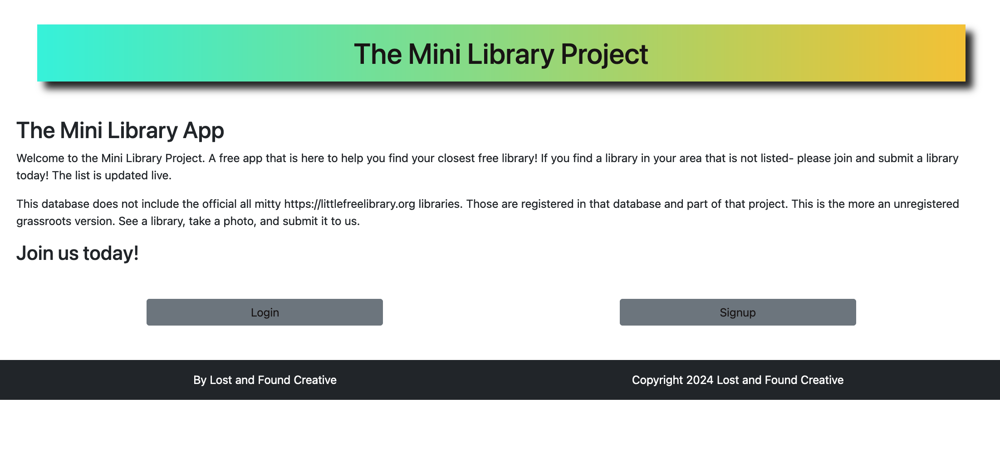
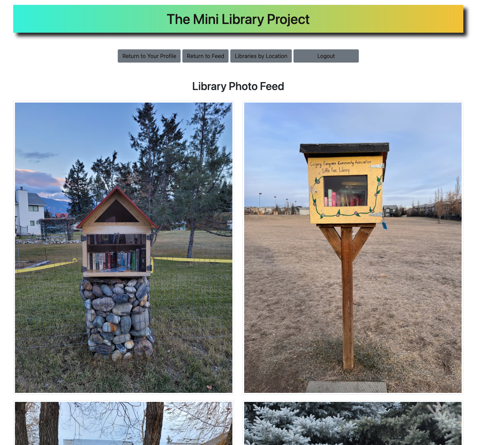
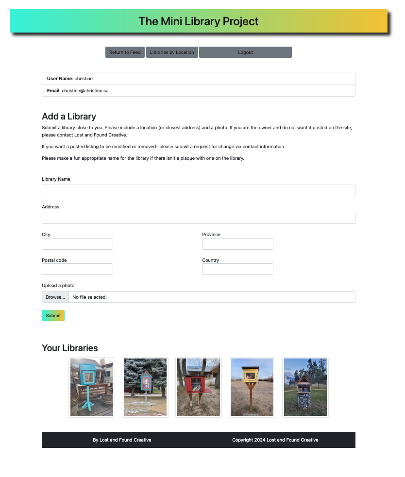
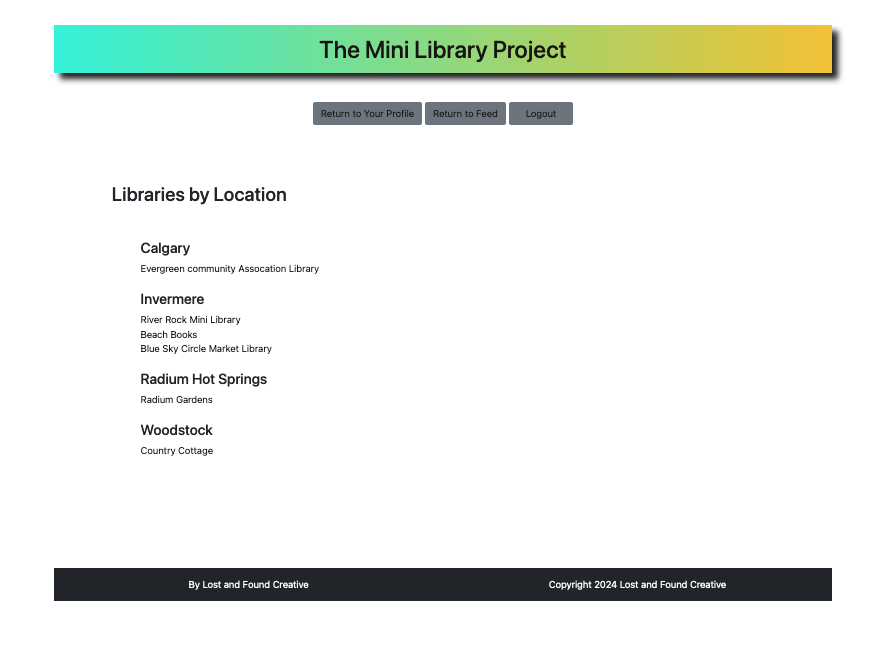

<h2> Full Stack App Project with 100 Devs</h2>






<h3>Built with:</h3>
<ul>
  <li>HTML </li> 
  <li>Boostrap + CSS (Flexbox and CSS Grid)</li>
  <li>MVC</li>
  <li>MongoDB</li> 
  <li>NOode.JS</li>
  <li>CLoudinary</li> 
    <li>Google Auth</li> 
  
</ul>


<bWhat I learned </b>

<ul>
  <li>CRUD</li>
  <li>Storing data</li>
  <li>MVC</li>
  <li>Forms</li>
  <li>Connecting the front to the back end</li>

</ul>

<b>Continued development</b>

<b>I'd like to:</b>

Add a comments section to each photo


<b>Quick start:</b>

```
$ yarn # npm install
$ yarn build # npm run build
````

## Development

Run Webpack in watch-mode to continually compile the JavaScript as you work:

```
$ yarn watch # npm run watch
```

Build using Scrimba Tutorial on React.

Happy Coding!

# Install

`npm install`

---

# Things to add

- Create a `.env` file in config folder and add the following as `key = value`
  - PORT = 2121 (can be any port example: 3000)
  - DB_STRING = `your database URI`
  - CLOUD_NAME = `your cloudinary cloud name`
  - API_KEY = `your cloudinary api key`
  - API_SECRET = `your cloudinary api secret`

---

# Run

`npm start`
